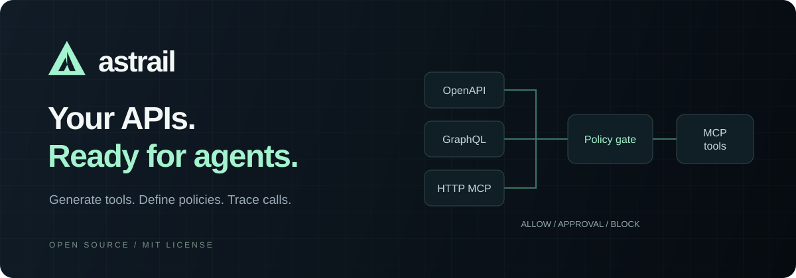
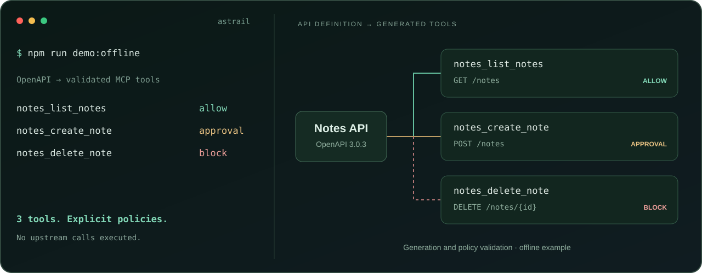
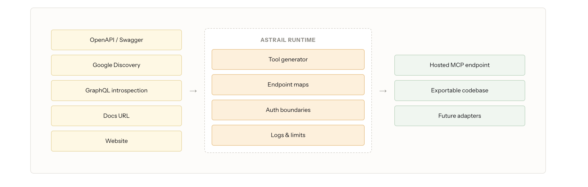
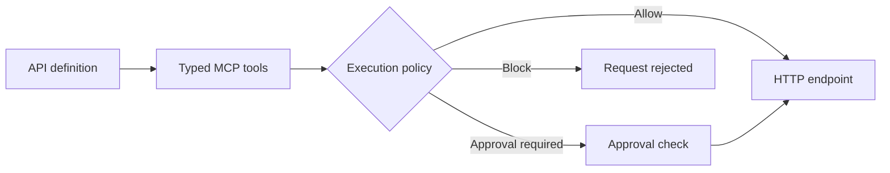

<p align="center">
  
</p>

<p align="center"><strong>Turn APIs into agent tools. Control every call.</strong></p>

<p align="center">Built by <a href="https://x.com/rizawastaken">Riza</a> and <a href="https://x.com/Aditya_Sinha03">Aditya</a>.</p>

<p align="center">
  Open-source API-to-MCP generation and runtime.<br>
  Typed tools, credential handling, approval policies, and execution traces in one codebase.
</p>

<p align="center">
  <a href="https://www.astrail.dev/">Website</a> ·
  <a href="#quick-start">Quick start</a> ·
  <a href="#see-it-in-action">Demo</a> ·
  <a href="#how-it-works">How it works</a> ·
  <a href="#documentation">Docs</a> ·
  <a href="#contribute">Contribute</a>
</p>

<p align="center">
  <a href="https://github.com/codewithriza/astrail/actions/workflows/cloud-qa.yml"></a>
  <a href="https://github.com/codewithriza/astrail/actions/workflows/repository-quality.yml"></a>
  <a href="LICENSE"></a>
  <a href="#quick-start"></a>
</p>

Astrail turns API definitions into typed tools that agents can discover and call through the Model Context Protocol (MCP). Import a spec, generate the tools, and configure how they execute. The runtime brings authentication, OAuth, approvals, network policy, and traces into the same workflow.

- **Start with the API you already have.** Import OpenAPI/Swagger, Google Discovery, GraphQL, or an existing HTTP MCP server.
- **Make execution explicit.** Configure allow, approval, and block policies alongside credential and scope checks.
- **Inspect the path from tool to endpoint.** Calls follow deterministic endpoint maps; Code Mode compiles supported calls without evaluating generated JavaScript.
- **Try the core locally.** The offline example generates and validates tools without a database, account, model key, or upstream API call.

<details>
<summary><strong>On this page</strong></summary>

- [Why Astrail](#why-astrail)
- [Use cases](#use-cases)
- [Quick start](#quick-start)
- [See it in action](#see-it-in-action)
- [How it works](#how-it-works)
- [Capabilities](#capabilities)
- [Run the dashboard](#run-the-dashboard)
- [Connect to an endpoint](#connect-to-an-endpoint)
- [Documentation](#documentation)
- [Repository layout](#repository-layout)
- [Development](#development)
- [Current boundaries](#current-boundaries)
- [Contribute](#contribute)
- [Community and links](#community-and-links)
- [License](#license)

</details>

## Why Astrail

An agent needs more than an API description to take an action: it needs a tool schema, a route to execute, credentials, and rules for when the call is allowed. Astrail brings those pieces into one workflow.

Import the API definition, inspect the generated tools, then expose a configured MCP endpoint. Runtime calls resolve through endpoint maps, pass authentication and policy checks, and execute against the upstream API. Traces help you inspect what happened. Generated source is available for export; the hosted runtime does not evaluate it.

## Use cases

Examples to build with your own APIs and credentials:

| Workflow | Tools to expose | Policy to consider |
| --- | --- | --- |
| Support | Find tickets and prepare updates | Require approval for changes |
| Operations | Look up inventory and create purchase orders | Allow reads; review purchases |
| Internal tools | Search CRM records and update account fields | Limit tools and credentials by role |

These are integration ideas, not bundled end-to-end automations. Start with a small contract and verify each tool before enabling writes.

## Quick start

Requires **Node.js 22.18+** and npm. No database, model API key, or account is needed for this example.

```bash
git clone https://github.com/codewithriza/astrail.git
cd astrail
npm ci
npm run demo:offline
```

## See it in action



*Visual summary of the runnable offline example below.*

The example runs the real generation pipeline against a small [Notes API spec](examples/openapi-to-tools/openapi.json):

```text
notes_list_notes    allow
notes_create_note   approval
notes_delete_note   block
```

It validates the generated tools and their policies, with network access disabled. It generates tools; it does not execute the fictional Notes API. Read the [example](examples/openapi-to-tools/README.md), change the spec, and inspect the result.

## How it works



*Architecture overview. Future adapters are planned; website support is limited to public read workflows. See [current boundaries](#current-boundaries) for deployment and export limitations.*



The offline example stops at generation and policy validation. A configured deployment adds authentication, credential handling, execution, and traces.

## Capabilities

| Area | Included |
| --- | --- |
| Import | OpenAPI/Swagger, Google Discovery, GraphQL, existing HTTP MCP servers |
| Generate | Typed tools, searchable endpoint catalogs, constrained Code Mode |
| Control | Authentication, OAuth scopes, approvals, network policy, bounded retries |
| Inspect | Execution traces and request validation |
| Connect | Dashboard, CLI, TypeScript and Python clients, SDK exports |
| Export | Manual Cloudflare Worker exports with a narrower runtime feature set |

See the [architecture guide](docs/ARCHITECTURE.md) for the request flow and module boundaries.

## Run the dashboard

```bash
cp .env.local.example .env.local
npm run dev
```

Open [localhost:3000](http://localhost:3000). The local environment example enables development-only demo auth. This preview does not replace a persistent backend. For stored servers, real users, and provider credentials, configure [Neon](docs/NEON_BACKEND.md) and [authentication](docs/neon-auth-setup.md), apply the schema, and follow the [platform setup guide](docs/PLATFORM_GUIDE.md#local-setup).

AI-assisted generation is optional. Deterministic generation works without `ANTHROPIC_API_KEY`. Hosted operation currently depends on Neon Auth/Data API; this is not yet a database-independent, one-command deployment.

For container deployment, follow the [Docker guide](docs/DOCKER.md).

## Connect to an endpoint

After creating a server in your own deployment:

```bash
export ASTRAIL_MCP_ENDPOINT='https://YOUR_HOST/api/mcp/YOUR_SERVER_ID'
export ASTRAIL_API_KEY='YOUR_API_KEY'
node bin/astrail.mjs status
node bin/astrail.mjs tools list
```

Use `node bin/astrail.mjs help` for calls, connector discovery, and the stdio bridge. See the [CLI guide](docs/CLI.md) for configuration and protocol limits. Public package releases are not yet available; run the CLI from this checkout.

## Documentation

| I want to… | Start here |
| --- | --- |
| Try generation without credentials | [Offline example](examples/openapi-to-tools/README.md) |
| Run a local demo | [Demo walkthrough](docs/DEMO.md) |
| Configure a persistent deployment | [Platform setup](docs/PLATFORM_GUIDE.md#local-setup) · [Docker](docs/DOCKER.md) |
| Connect an MCP client | [CLI and stdio bridge](docs/CLI.md) |
| Understand the codebase | [Architecture](docs/ARCHITECTURE.md) |
| Review execution and security controls | [Runtime permissions](docs/runtime-permissions.md) · [Threat model](docs/THREAT_MODEL.md) |
| Make a contribution | [Contributing](CONTRIBUTING.md) · [Engineering standards](docs/ENGINEERING.md) |
| Explore all guides | [Documentation index](docs/README.md) |

## Repository layout

```text
app/                 Next.js pages and API routes
lib/                 Generation, authentication, and runtime logic
components/          Shared UI components
bin/                 CLI and transport helpers
sdk/                 TypeScript and Python clients
database/            Base schema and incremental migrations
config/typescript/   Focused smoke-test compiler configurations
tests/               Unit, SDK, and browser tests
scripts/             Development and verification commands
examples/            Runnable examples
docs/                Setup and architecture guides
```

## Development

```bash
npm test             # unit regressions and core smoke checks
npm run check        # repository checks, lint, types, tests, and build
```

CI also runs runtime security, OAuth, integration, export, and UI smoke checks. Changes to those areas require their corresponding tests; see [CONTRIBUTING.md](CONTRIBUTING.md).

## Current boundaries

Astrail is an early project. Website automation is limited to public read workflows. Code Mode statically compiles supported calls; it cannot execute arbitrary JavaScript. Worker export has a narrower feature set than the hosted runtime. Multi-region deployments need distributed limits and external edge protection. Provider OAuth applications and scopes require operator configuration.

Do not treat tool descriptions or approval metadata alone as an authorization boundary. Read the [threat model](docs/THREAT_MODEL.md), [security policy](SECURITY.md), and [runtime permissions](docs/runtime-permissions.md) before exposing a deployment.

## Contribute

Useful starting points are reproducible importer bugs, minimal OpenAPI fixtures, clearer setup instructions, and tests for provider edge cases. Start with the [contribution guide](CONTRIBUTING.md) and [roadmap](ROADMAP.md). Open a discussion before a large architectural change.

- [Report a bug](https://github.com/codewithriza/astrail/issues/new?template=bug_report.yml)
- [Propose an improvement](https://github.com/codewithriza/astrail/issues/new?template=feature_request.yml)
- [Browse technical documentation](docs/README.md)

## Community and links

[](https://www.astrail.dev/)
[](https://discord.com/invite/2ThMPM2UWm)
[](https://x.com/getastrail)
[](https://www.linkedin.com/company/getastrail)

Built by **Riza and Aditya**. Follow us for Astrail updates and what we’re building next.

**Riza**

[](https://x.com/rizawastaken)
[](https://www.linkedin.com/in/codewithriza/)

**Aditya**

[](https://x.com/Aditya_Sinha03)
[](https://www.linkedin.com/in/aditya-sinha-030508/)

## License

[MIT](LICENSE). Dependencies retain their own licenses. Astrail names and logos are not covered by a trademark grant.

---

### Why we open-sourced it

We built Astrail because connecting agents to APIs meant writing the same tool definitions, auth handling, and request logic over and over. We wanted to make that easier.

We applied to YC twice. For S26, we got an interview with YC partners Harshitha Arora and Diana Hu. For F26, we made the top 10%. We decided we wanted to work on something else, so we open-sourced Astrail. There’s still plenty here to use and build on. Play around with it and let us know what you make.

— **Riza & Aditya**
